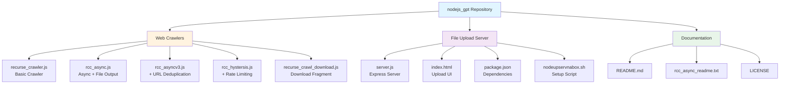
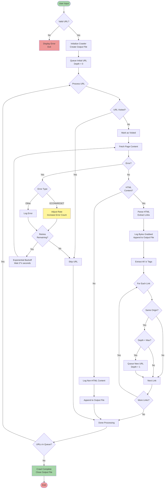
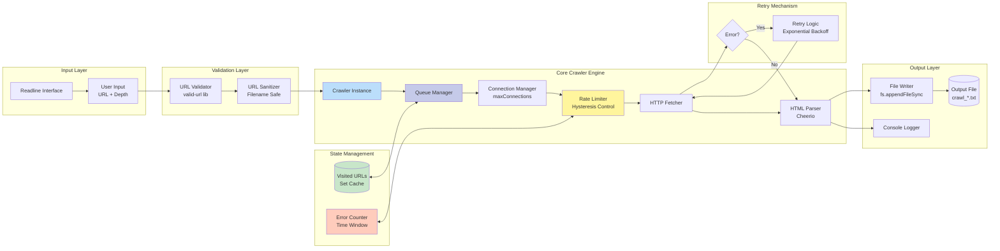
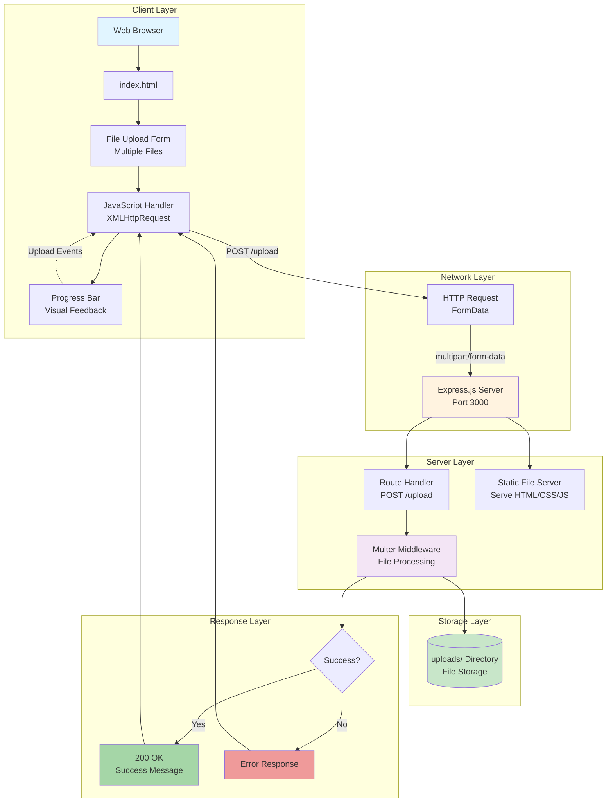
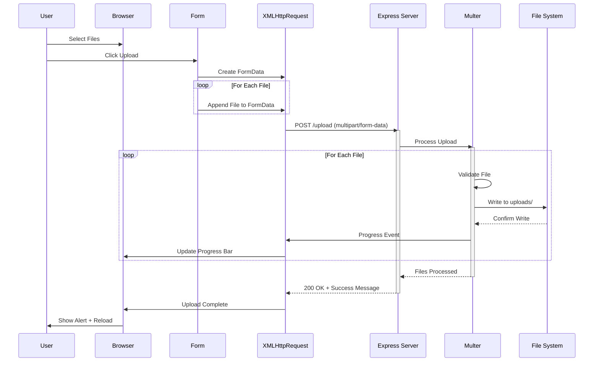
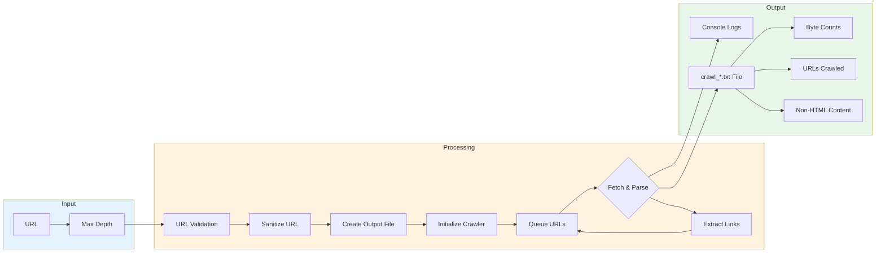
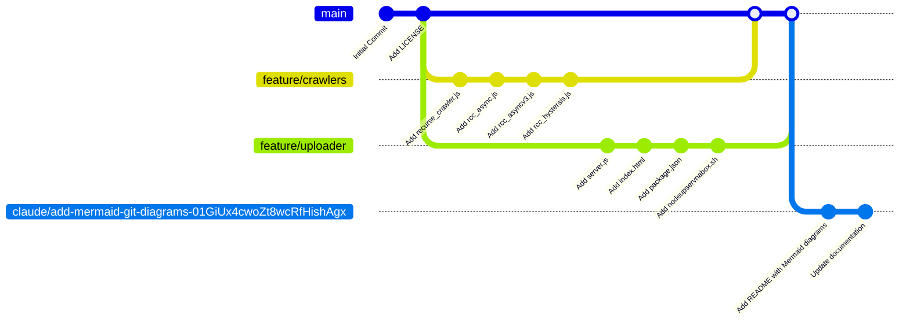

# Node.js GPT - Web Crawler & File Upload Suite

A comprehensive Node.js project featuring multiple web crawler implementations with progressive enhancements and a file upload server with progress tracking.

## Table of Contents

- [Repository Structure](#repository-structure)
- [Web Crawler Architecture](#web-crawler-architecture)
- [Crawler Evolution](#crawler-evolution)
- [File Upload Server](#file-upload-server)
- [Data Flow](#data-flow)
- [Git Workflow](#git-workflow)
- [Installation](#installation)
- [Usage](#usage)
- [Code Review & Improvements](#code-review--improvements)

## Repository Structure



## Web Crawler Architecture

### Crawler Evolution Timeline

```mermaid
timeline
    title Web Crawler Evolution
    section V1 : Basic
        recurse_crawler.js : Simple recursive crawling
                           : Max connections: 10
                           : Depth-based limiting
                           : In-memory processing
    section V2 : Async
        rcc_async.js : Async/await support
                     : File output logging
                     : URL validation
                     : Timestamped results
    section V3 : Optimized
        rcc_asyncv3.js : URL deduplication
                       : Visited URLs cache
                       : Better error handling
                       : Reduced connections: 6
    section V4 : Advanced
        rcc_hystersis.js : Dynamic rate limiting
                         : Retry mechanism
                         : Error-based throttling
                         : Hysteresis control
```

### Web Crawler Flow Diagram



### Crawler Component Architecture



## File Upload Server

### Server Architecture



### Upload Data Flow



## Data Flow

### Crawler Data Flow



## Git Workflow



## Installation

### Prerequisites

- Node.js (v14 or higher)
- npm or yarn

### Web Crawler Setup

```bash
# Install crawler dependencies
npm install crawler readline fs path valid-url

# Or install all at once
npm install
```

### File Upload Server Setup

```bash
# Navigate to the uploader directory
cd nodejs_uploader

# Install dependencies
npm install

# Or use the setup script
chmod +x nodeupservnabox.sh
./nodeupservnabox.sh
```

## Usage

### Running Web Crawlers

#### Basic Crawler
```bash
node recurse_crawler.js
# Enter URL when prompted
# Enter max depth when prompted
```

#### Async Crawler with File Output
```bash
node rcc_async.js
# Results saved to crawl_<sanitized_url>_<timestamp>.txt
```

#### Optimized Crawler (Recommended)
```bash
node rcc_asyncv3.js
# Includes URL deduplication and better error handling
```

#### Advanced Crawler with Rate Limiting
```bash
node rcc_hystersis.js
# Automatic rate adjustment based on errors
# Retry mechanism with exponential backoff
```

### Running File Upload Server

```bash
cd nodejs_uploader
node server.js
# Server starts on http://localhost:3000
```

Then open your browser to `http://localhost:3000` and use the upload interface.

## Code Review & Improvements

### Identified Issues

#### 1. **Web Crawlers**

**Issue: Memory Leaks**
- **Location**: All crawler files
- **Problem**: `visitedUrls` Set grows unbounded for large crawls
- **Recommendation**: Implement LRU cache or periodic cleanup

**Issue: Error Handling**
- **Location**: `recurse_crawler.js:16-17`
- **Problem**: Errors are only logged, not properly handled
- **Recommendation**: Add retry logic and graceful degradation

**Issue: Callback Management**
- **Location**: `rcc_async.js:62-75`
- **Problem**: Mixing promises with callbacks causes potential race conditions
- **Recommendation**: Fully convert to async/await or use promises consistently

**Issue: Security**
- **Location**: `rcc_asyncv3.js:68`
- **Problem**: `encodeURI()` insufficient for malicious URLs
- **Recommendation**: Use `encodeURIComponent()` for path segments and add URL whitelist

**Issue: Rate Limiting Logic**
- **Location**: `rcc_hystersis.js:31-42`
- **Problem**: Hysteresis algorithm too aggressive, can deadlock at minConnections
- **Recommendation**: Add gradual recovery and minimum successful requests threshold

**Issue: File I/O**
- **Location**: All async crawlers
- **Problem**: Synchronous `fs.appendFileSync()` blocks event loop
- **Recommendation**: Use `fs.promises.appendFile()` for async operations

**Issue: URL Deduplication**
- **Location**: `rcc_asyncv3.js:19`
- **Problem**: Case-sensitive URL comparison misses duplicates
- **Recommendation**: Normalize URLs (lowercase, remove trailing slashes, sort params)

#### 2. **File Upload Server**

**Issue: Security - File Upload**
- **Location**: `server.js:10`
- **Problem**: No file type validation or size limits
- **Recommendation**:
  ```javascript
  const upload = multer({
    dest: 'uploads/',
    limits: { fileSize: 10 * 1024 * 1024 }, // 10MB
    fileFilter: (req, file, cb) => {
      const allowedTypes = /jpeg|jpg|png|pdf/;
      const extname = allowedTypes.test(path.extname(file.originalname).toLowerCase());
      const mimetype = allowedTypes.test(file.mimetype);
      if (mimetype && extname) {
        return cb(null, true);
      }
      cb(new Error('Invalid file type'));
    }
  });
  ```

**Issue: Missing Error Handling**
- **Location**: `server.js:12-16`
- **Problem**: No error handling in upload route
- **Recommendation**: Add try-catch and validate request

**Issue: CORS**
- **Location**: `server.js`
- **Problem**: No CORS configuration for cross-origin requests
- **Recommendation**: Add `cors` middleware

**Issue: Missing Uploads Directory**
- **Location**: `server.js:10`
- **Problem**: No check if `uploads/` directory exists
- **Recommendation**: Create directory on startup

**Issue: Static File Serving**
- **Location**: `server.js:19-21`
- **Problem**: Serves index.html from both root route and static middleware (potential conflict)
- **Recommendation**: Remove duplicate route or adjust middleware

**Issue: Frontend - XSS Risk**
- **Location**: `index.html:44`
- **Problem**: `alert()` with server response could be XSS vector
- **Recommendation**: Sanitize server response before display

#### 3. **General Issues**

**Issue: No package.json in Root**
- **Location**: Repository root
- **Problem**: Crawler dependencies not managed
- **Recommendation**: Create root `package.json` with all dependencies

**Issue: No Error Logging**
- **Location**: All files
- **Problem**: No centralized logging mechanism
- **Recommendation**: Implement Winston or Pino for structured logging

**Issue: No Tests**
- **Location**: Repository
- **Problem**: No unit or integration tests
- **Recommendation**: Add Jest/Mocha tests for critical functions

**Issue: Configuration Hardcoded**
- **Location**: All files
- **Problem**: No configuration file for settings
- **Recommendation**: Create `config.js` or use environment variables

### Recommended Improvements

#### High Priority

1. **Add Security Measures**
   - File upload validation and sanitization
   - URL whitelist for crawler
   - Rate limiting on upload endpoint
   - Input validation across all user inputs

2. **Fix Async/Promise Handling**
   - Fully migrate to async/await
   - Remove callback/promise mixing
   - Proper error propagation

3. **Add Resource Management**
   - LRU cache for visited URLs
   - Async file I/O
   - Connection pooling

#### Medium Priority

4. **Implement Proper Logging**
   - Structured logging with log levels
   - Separate error logs
   - Rotation for log files

5. **Add Configuration Management**
   - Environment variables
   - Config files for different environments
   - Validation of configuration

6. **Create Root Package Management**
   - Single `package.json` for workspace
   - Unified dependency management
   - npm scripts for common tasks

#### Low Priority

7. **Add Testing**
   - Unit tests for utility functions
   - Integration tests for crawlers
   - E2E tests for upload server

8. **Documentation**
   - JSDoc comments for functions
   - API documentation
   - Architecture decision records (ADRs)

9. **Monitoring & Observability**
   - Performance metrics
   - Crawler statistics
   - Upload analytics

### Security Checklist

- [ ] File upload type validation
- [ ] File size limits
- [ ] Malicious filename sanitization
- [ ] Path traversal prevention
- [ ] CSRF protection for upload endpoint
- [ ] Rate limiting on all endpoints
- [ ] URL validation and sanitization in crawler
- [ ] Prevent SSRF attacks in crawler
- [ ] Add helmet.js for HTTP security headers
- [ ] Environment variable validation
- [ ] Secrets management (if needed)
- [ ] Input sanitization across all user inputs

## Contributing

1. Fork the repository
2. Create a feature branch (`git checkout -b feature/amazing-feature`)
3. Commit your changes (`git commit -m 'Add amazing feature'`)
4. Push to the branch (`git push origin feature/amazing-feature`)
5. Open a Pull Request

## License

This project is licensed under the terms specified in the LICENSE file.

## Author

See git history for contributors.

---

**Note**: This README was generated with comprehensive Mermaid diagrams to visualize the project architecture, data flows, and workflows. The code review section identifies critical security and performance issues that should be addressed before production use.
